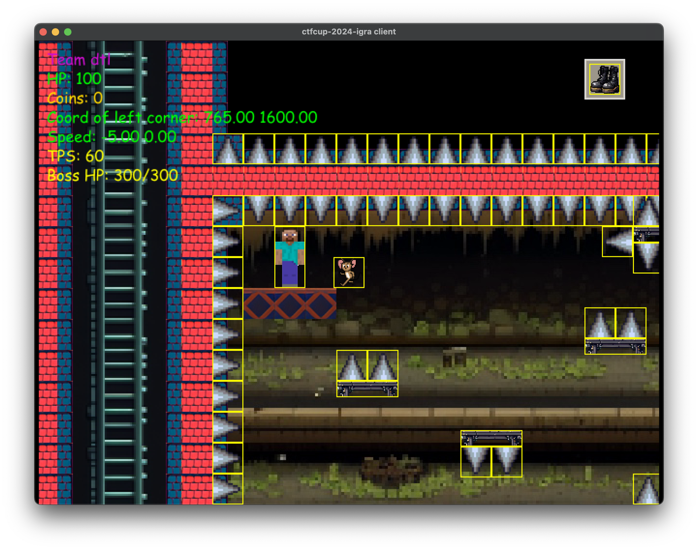

# ctfcup-2024-igra

Cheats, tweaks to the engine and other tools, developed by [dtl](https://github.com/dtlhub) team in preparation for and during [CTFCUP 2024](https://ctfcup.ru/) finals.



## Cheats

### Utility scripts

There are two utility scripts in the `scripts` directory:

#### Launch game server locally

```
./scripts/server.sh
```

#### Launch client

Command below will start the game client and connect either to the local server or to the remote server.

```
./scripts/client.sh <local|remote>
```

#### Environment variables

You can pass environment variables to both client and server, e.g.:

```
REWIND_TPS=300 REWIND_FILE=rewind/level-1.json ./scripts/client.sh <local|remote>
```

### Rewind

Allows to save game's state and replay it later, basically checkpoint system.

#### Configuration:

- `REWIND_FILE` - path to the rewind file, e.g. `REWIND_FILE=rewind/level-1.json`. If not set, rewind will not be used.

- `REWIND_TPS` - set TPS for rewind replay, e.g. `REWIND_TPS=100`. If not set, defaults to 6000 TPS (x100 regular game speed).

- `REWIND_SKIP_EMPTY` - if set to non-empty value, empty frames will be skipped. Frame is considered empty if the player is not moving and no keys are pressed. Note that movement of other entities in the world is not considered, so you shouldn't skip frames if that is important.

#### Hotkeys:

- `X` - save rewind up to the current moment to file.
- `Shift+R` — reset recording. Note that this will also restart the game, as `R` is handled as usual.

### TPS (ticks per second)

- `+` - increase TPS.
- `-` - decrease TPS.

For both of these keys, whether the shift is pressed or not does not matter.

### Better movement

- Left / Right arrow keys — move player left / right and pause the game, once released.
- Up arrow key — jump and pause the game, once released.
- `Z` / down key — unpause the game while the key is held down and pause it once released.

### Free camera (noclip)

- `N` — to toggle free camera on/off.
- `I` / `J` / `K` / `L` — move free camera up /left / down / right.
- `U` / `O` — slow down / speed up free camera.

### NPC Dialod

- `Ctrl+V` — paste text from clipboard into the dialog.

### Destructive cheats

Destructive cheats are cheats that break the game in a way that doesn't pass checksum validation on the side of unmodified server. But they can be used with the local server for experimentation and such.

Destructive cheats are enabled on both client and server by setting `CHEATS=1` environment variable.

At the moment, the following functionality is enabled with destructive cheats:

- Damage from spikes is set to 0.

### Misc

#### Configuration via environment variables

- `MONITOR` - set monitor to use, e.g. `MONITOR="DELL U2720Q"`. If selected monitor is not found, the game will use the first available monitor and the list of all available monitors will be printed to the console.

- `INITIAL_TPS` - set initial TPS for the game (applied after rewind replay). If not set, defaults to 60 TPS.

- `MUTED` - if set to 1, the game will start up muted.

- `VISIBLE_COLLISIONS` - set all collidable objects texture to brick.
